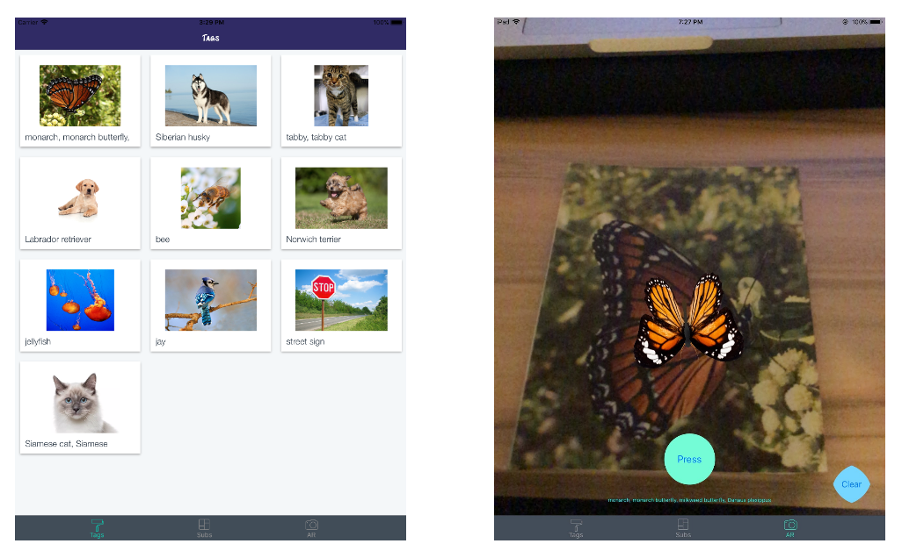
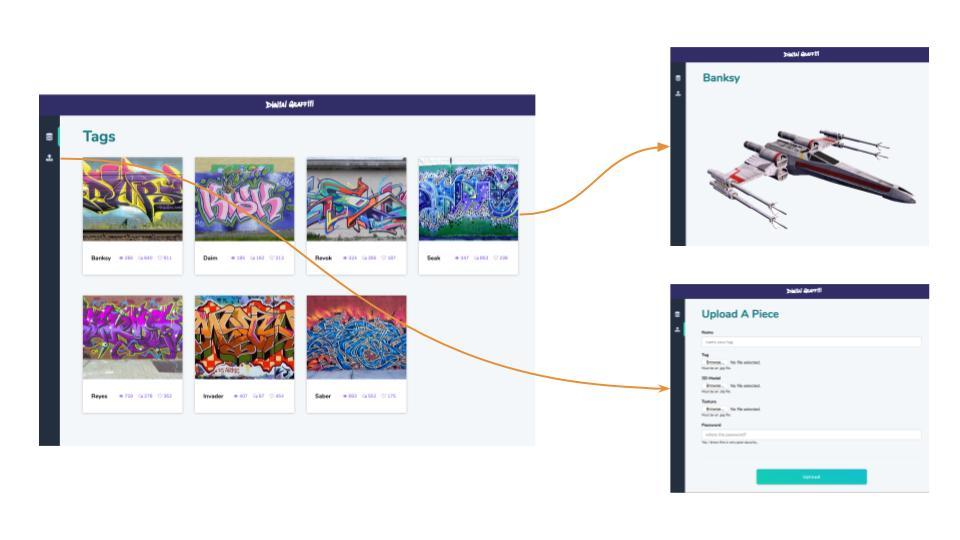
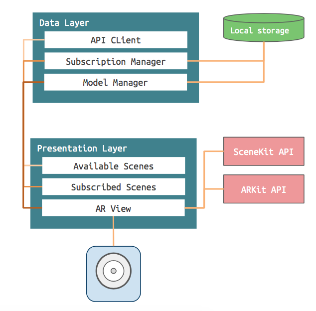

# Digital Graffiti (Web app repo)


Digital Graffiti is an AR experience that lets users place tags in their environment to display 3D models. When a user encounters a tag in the wild, this application allows one to view the 3D model associated with that tag in augmented reality. 

**Authors**: Eric Gossett, Yunhan Wang and John Bralich.





# Web App





The Digital Graffiti web application provides the back-end data store for all users and 3D assets used by the mobile application. It consist of a web front-end to preview and upload models as well as REST API endpoints to fetch assets. From here, users will upload their tags and models for use in the mobile app.


### The Stack


- **Flask** - Web micro-framework for Python.

- **MongoDB** - Document-oriented database.

- **Gunicorn** - Python WSGI HTTP server used to host the Flask application. 

- **NGINX** - The proxy server placed in front of Gunicorn. NGINX handles all incoming request and passes it to Gunicorn. Then it receives the response from Gunicorn and forwards the response to the original client. 


### Other things included (for future development):

- **Celery** - Celery provides a distributed task queue that would allow the web application to run background task. The idea was that we would do some post-processing to the uploaded models in order to make sure there size and origin point were consistent. Instead we opted to only upload models that will not appear to large in the ARKit view.

- **Redis** - This would of acted as the broker for Celery.


# IOS App 

 [repo for iOS app here](https://github.com/ericgossett/digital-graffiti)




The Digital Graffiti application consists of two layers the data and presentation layer.

## The Data Layer

The data layer handles fetching 3D assets from the web server, the storage of subscribed users and 3D assets on the device and loading assets into the ARView. It consists of the following:

- **APIClient** - Handles all communication with the web server. Includes methods to fetch the list of users and download asset files.

- **ModelManager** - Handles storing fetched assets to disk. Also handles loading assets and building SCNodes for the ARKit scene.

- **SubscriptionManager** - A singleton which acts as the local store. It contains a list of all subscribed users along with methods to subscribe/unsubscribe.


## The Presentation Layer

The presentation layer consists of 3 views:

- **AvailableView** - Displays a grid of cards showing the username and tag. When a card is clicked, the app subscribes to that user.

- **SubscriptionView** - Shows a table of all the tags a user subscribed to. From this view one may unsubscribe to a user. 

- **ARView** - Detects a tag in the wild and displays the associated model if the user subscribed to that tag.


## Challenges

When we first thought of the app we wanted to have 3D locations be determined based on geo-location. So users can tag a location on the map and anyone following the artist could view the 3D model if they are present at that location. However, we learned early on that this was too involved given the alloted time for the class project. 

We decided that a good alternative would be to have the tags be an image that will serve as an anchor point for the 3D model to appear. So, if someone found the tag (image) they can view it in the app and the model will appear. While this should of been straightforward, we found out later on that classifying the images would be a challenge.

 Lastly, very early in the project we decided to store on a server and access them via a REST API. However, we found out that SceneKit wants all the model info to be available when the app is built. So loading models dynamically provided to be another issue. 


 Herein I will describe how we overcame these challenges:


### detecting tags

 Unfortunately, we encountered the tag issue very late in development. So we had no choice but to come up with a quick solution. While looking for a solution, one of my teammates (John) came up with the idea to use a pre-trained ML model (Inception v3) to handle classifying our tags. Therefore, we can then restrict the tags to the catagories in Inception v3 such that when an image of a category is detected it will display a 3D model of that category (e.g image of a butterfly will show a 3D butterfly). Due to some catagories being similar (cat vs. tabby cat) we check if the classification is in the top 10 to determine wherever or not to show the model. This was done using the new CoreML API as seen in the code below (not written by me):

 ```swift
    /* this func is used to take the current frame for a machine learning model (inception v3) and perform image recognition. If one of the image recognition result matches a subscribed artist, will display the associated 3d model associated with that artist */
func performImageRecognition(){
    // Use current frame as the input of image recognition for the inception v3 model
    if let currentFrame = sceneView.session.currentFrame {
        DispatchQueue.global(qos: .background).async {
            do {
                let model = try VNCoreMLModel(for: Inceptionv3().model)
                let request = VNCoreMLRequest(model: model, completionHandler: { (request, error) in
                    // Jump onto the main thread
                    DispatchQueue.main.async {
                        // Access the first result in the array after casting the array as a VNClassificationObservation array
                        guard let results = request.results as? [VNClassificationObservation], let _ = results.first else {
                            self.identifiedObject.text = "No results?"
                            return
                        }
                        // Acess the top 10 classes in the array of results from the inception v3 model
                        if(subscribedArtists.count > 0){
                            for i in 0...subscribedArtists.count - 1{
                                for j in 0..<10{ // top 10 classes
                                    if(subscribedArtists[i].artist.username == results[j].identifier){
                                        self.identifiedObject.text = results[j].identifier // the label will only change when detected a subscribed artist
                                        self.loadCustomModel(username: subscribedArtists[i].artist.username)
                                        break
                                    }
                                }
                            }
                        }
                    }
                })
                let handler = VNImageRequestHandler(cvPixelBuffer: currentFrame.capturedImage, options: [:])
                try handler.perform([request])
            } catch {}
        }
    }
}
```
 


### loading models

It was a big concern when we first discovered that 3D assets must be compiled with the app. However, after searching for a solution I encountered a blog post that described how to load 3D assets using the ModelIO API ([link](http://iosdeveloperzone.com/2016/05/10/getting-started-with-modelio/)). Using this as an example I created a Model Manager class that handles fetching the models form the web API and preparing them as SCNNodes to load in the AR view. The main functionality of this class takes place in the methods ```saveAssets``` and ```getSCNNode```. The ```saveAssets``` method fetches the model and texture files from the api and saves them to disk. Once on disk the ```getSCNNode``` function loads the assets and uses ModelIO to create a SCNNode that can be appended to the Scene in the ARView.

```swift
/*** Fetches 3D assets from the server and stores them on disk.
    This is used by the subscription manager and is called when a
    user is subscribed to.
*/
func saveAssets(username: String, completion: ((URL, URL) -> Void)?) {
    self.api.fetchModel(username: username) { (modelData) in
        self.api.fetchTexture(username: username) { textureData in
            let modelFile = self.assetURL.appendingPathComponent("\(username)_model.obj")
            try? modelData.write(to: modelFile, options: .atomic)

            let textureFile = self.assetURL.appendingPathComponent("\(username)_texture.obj")
            try? textureData.write(to: textureFile, options: .atomic)

            completion?(modelFile, textureFile)
        }
    }
}

/*** Loads the 3D assets and creates a SCNNode which can be appended
    to the SCNkit scene in the ARView.
    
    - First a MDL mesh is created from the .obj file
    - Next a MDLMaterial is created using the texture file.
    - Finally, each submesh in the MDL mesh is looped over to apply the
    material and the SCNode is created.
*/
func getSCNNode(username: String) throws -> SCNNode {
    do {
        let assets = try loadAssets(username: username)
        let model = MDLAsset(url: assets.modelFile)
        let object = model.object(at: 0) as! MDLMesh
        let scatteringFunction = MDLScatteringFunction()
        
        let material = MDLMaterial(
            name: "baseMaterial",
            scatteringFunction: scatteringFunction
        )
        
        let matProp = MDLMaterialProperty(
            name: "\(username)_texture.jpg",
            semantic: .baseColor,
            url: assets.textureFile
        )
        material.setProperty(matProp)
    
        for submesh in object.submeshes! {
            if let mesh = submesh as? MDLSubmesh {
                mesh.material = material
            }
        }

        return SCNNode.init(mdlObject: object)

    } catch {
        throw ModelManagerError.AssetFilesNotFound
    }
}
```