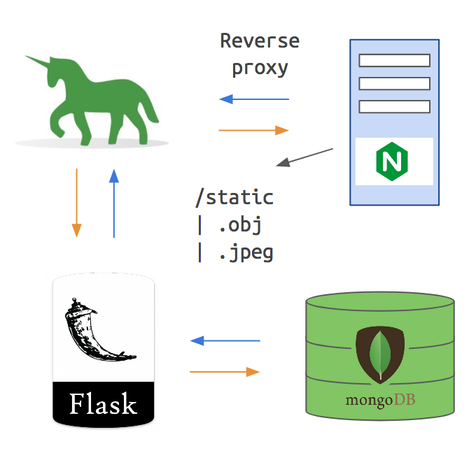

# Digital Graffiti Web Application

## Overview

The Digital Graffiti web application provides the back-end data store for all users and 3D assets used by the mobile application. It consist of a web front-end to preview and upload models as well as REST API endpoints to fetch assets.

**URL:** [http://vcm-2006.vm.duke.edu/](http://vcm-2006.vm.duke.edu/) 

### The Stack



- **Flask** - Web microframework for Python.

- **MongoDB** - Document-oriented database.

- **Gunicorn** - Python WSGI HTTP server used to host the Flask application. 

- **NGINX** - The proxy server placed in front of Gunicorn. NGINX handles all incoming request and passes it to Gunicorn. Then it receives the response from Gunicorn and forwards the response to the original client. 


### Other things included (for future development):

- **Celery** - Celery provides a distributed task queue that would allow the web application to run background task. The idea was that we would do some post-processing to the uploaded models in order to make sure there size and origin point were consistent. Instead we opted to only upload models that will not appear to large in the ARKit view.

- **Redis** - This would of acted as the broker for Celery.


# Installation

The entire application has been dockerized, making installation trivial. To install first make sure docker and docker-compose are installed on your machine.


Next, `cd` into the root directory (containing the `docker-compose.yml`) file and run: 

```
docker-compose build
```

This command will build the associated containers for this project. Once the build is complete, to start the containers run:

```
docker-compose up
``` 

If you go [127.0.0.1](http://127.0.0.1/) the web application should be visible. 

# Uploading

## PLEASE READ IN DETAIL

If you choose to upload your own model please make sure to following these instructions:

- **The username must be a label the ML model will recognize.** Furthermore, the label must be distinct enough that it will not clash with an existing upload (for instance tabby cat vs. siamese cat will result in a collision). We designed the application to display a model if the username (label) appears in the predictions top 10, so anything we uploaded must be distinct enough that they would not both appear in the top 10. 
    - A list of all possible labels are found [here](https://gist.github.com/yrevar/942d3a0ac09ec9e5eb3a).

- The tag must be an image that matches the username (label). 

- Images and textures must be in `.jpg` format and model files `.obj`.

- **Note:** some model files may be to large when displaying in the ARView.

- The password to upload files is TeamNoahsFTW. This is a very poor way to handle security, that was done in order to focus our efforts on the mobile app rather than proper authentication.

- To delete an upload you can do so using the API by running the following command, where `{username}` is the user to delete:

```
curl -X "DELETE" http://vcm-2006.vm.duke.edu/api/v1/delete/{username}\?password\=TeamNoahsFTW
```

# Other comments

we decided to ignore the following cosmetic issue present in the web front-end in order to focus on the mobile app:

- When previewing a model in the web application, sometimes the model will appear in the far distance. This is because the web application does not post-process the 3D models to ensure that all models have the same size and origin. However, if you zoom in enough the model will eventually appear. 